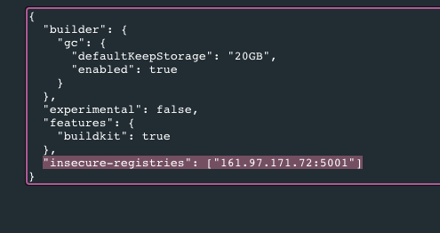

# Beatstore

Website made out of reactjs, nodejs, mongodb + telegrafjs for sort of admin panel that I use to manage website via telegram client.

### Technologies used:

#### Client side:

<i>I will specify several core components, technologies, that i used during development</i>

* `ReactJS`
* `react-player` - used as a base component for creating audio player
* `Redux` - state container
* Tried out multiple react ui libraries like `semantic-ui-react`, `material-ui` and `react-bootstrap` to see what works best for me :)
* `node-sass` - module to handle scss
* `@fortawesome` - component for beautiful icons

---

#### Server side | API:

* `Nodejs`
* `nodemailer` - to send confirmation emails and products itself
* `jsonwebtoken` - used to generate access and refresh tokens for login and signup handling
* `mongoose` - really cool ODM. It was a pure pleasure to work with it.
* `multer` - handy middleware for handling file uploads on the web-server.
* `expressjs` - super convenient web framework
* `@paypal/checkout-server-sdk` - paypal sdk for handling payment of the website

---

#### Server side | Telegram BOT:

* `Telegrafjs` - telegram bot framework

### Docker

Deploy Stack Locally

`docker stack deploy -c docker-compose.stack.yml --with-registry-auth beatstore`

1. #### frontend
    - build image
        - `docker build . -f docker/Dockerfile -t mama-mia`
    - run container
        - `docker run -p 80:80 mama-mia`

2. #### backend
    - build image
        - `docker build . -f docker/Dockerfile -t papa-mia`
    - run container
        - `docker run -p 3000:3000 papa-mia`

3. #### admin-bot
    - build image
        - `docker build . -f docker/Dockerfile -t daughter-mia`
    - run container
        - `docker run -p 3001:3001 daughter-mia`

#### Generate password via `htpasswd` and save to the _credentials_ file:

``htpasswd -Bbn <username> <password> > credentials``

#### Launch a dedicated private docker registry service with the following options:

- bind to 5001 port
- restart on-failure
- named as "registry"
- create a bind mount containing proper credentials (symlink)
- set registry auth type to htpasswd
- set password realm to whatever you want, it's just an auth scope
- set relative path to the credentials file created earlier
- we need only 1 replica here
- run the latest registry image

```shell
docker service create \
  -p 5001:5000 \
  --restart-condition="on-failure" \
  --name=registry \
  --mount type=bind,src=/root/registry,dst=/var/lib/registry \
  -e "REGISTRY_AUTH=htpasswd" \
  -e "REGISTRY_AUTH_HTPASSWD_REALM=Registry Realm" \
  -e REGISTRY_AUTH_HTPASSWD_PATH=/var/lib/registry/credentials \
  --replicas=1 \
  registry:latest

```

#### Add insecure registry in the daemon.json to be able to push there w/o TSL certificate (https)
